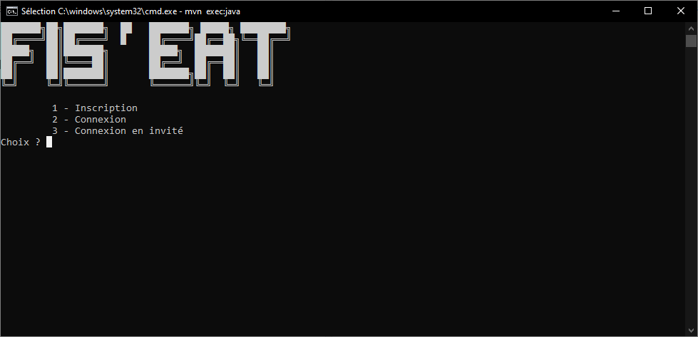
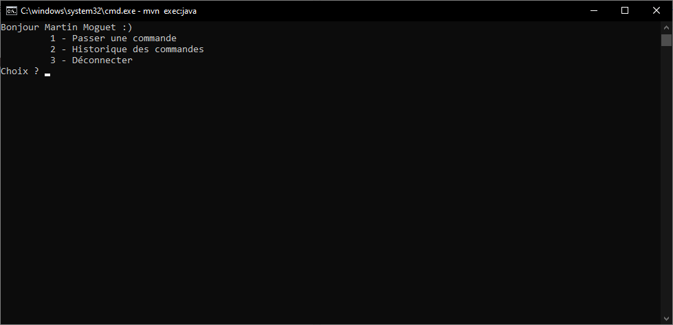
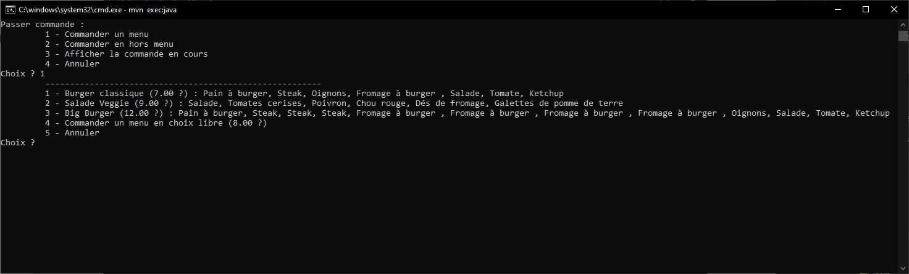

# FIS'eat

FIS'eat is an command terminal. It's possible to order menus and products without menus. 

## Prerequisites

*1. If it's the first launch of the application :*

In Main file, uncomment the line `Load.charger_fichiers();` : 

```java
public class Main {
    public static void main(String[] args) {
        // Load.charger_fichiers();
        MenuLayouts menu = new MenuLayouts();
        menu.page_accueil();
        menu.sc.close();
        menu.cuisine.shutdown_executor();
    }
}
```

*2. You need to install [Maven](https://maven.apache.org/downlo(ad.cgi)) and [Java16](https://www.oracle.com/java/technologies/javase/jdk16-archive-downloads.html)  to run this application.*

## Build and Run

*1. Clone the project :*

```
git clone https://github.com/maaart1/FIS-eat.git
```

*2. Go in the folder :*

```
cd FIS-eat/
```


*3. Compile the project :*

```
mvn compile
```

*4. Run the project :*

```
mvn exec:java
```

*5. Don't forget to create a client :*

```
1 - Inscription
Nom : XXXXXX
```

## Some pictures








